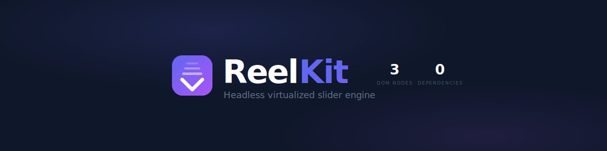
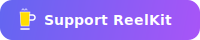

<picture>
  <source media="(prefers-color-scheme: dark)" srcset="assets/banner-dark.svg">
  <source media="(prefers-color-scheme: light)" srcset="assets/banner-light.svg">
  
</picture>

<p align="center">
  Single-item slider for TikTok/Instagram Reels-style experiences.<br/>
  Virtualized · Touch-first · Zero dependencies · Framework-agnostic
</p>

<p align="center">
  <a href="https://www.npmjs.com/package/@reelkit/core"></a>
  
  
  
  <br/>
  <a href="https://github.com/KonstantinKai/reelkit"></a>
</p>

> [!WARNING]
> **0.x.x** — ReelKit is under active development. APIs may change between minor versions until 1.0.

## Features

- **Virtualized** — only 3 slides in DOM, handles 10,000+ items
- **Touch first** — native swipe with momentum and snap
- **Zero dependencies** — ~6.0 kB gzip core
- **Keyboard & wheel** — arrow keys, scroll, and swipe navigation built in
- **Loop mode** — infinite circular scrolling
- **SSR ready** — works with Next.js, Remix, and any SSR setup
- **Auto-size** — omit size prop, uses CSS + ResizeObserver
- **TypeScript** — strict types, no `@types` needed

## Packages

| Package                                                                | Description                       | JS (gzip) |
| ---------------------------------------------------------------------- | --------------------------------- | --------- |
| [@reelkit/core](packages/reelkit-core)                                 | Framework-agnostic slider engine  | 6.0 kB    |
| [@reelkit/react](packages/reelkit-react)                               | React components and hooks        | 4.4 kB    |
| [@reelkit/react-reel-player](packages/reelkit-react-reel-player)       | Full-screen video reel player     | 4.2 kB    |
| [@reelkit/react-lightbox](packages/reelkit-react-lightbox)             | Image & video gallery lightbox    | 3.1 kB    |
| [@reelkit/stories-core](packages/reelkit-stories-core)                 | Framework-agnostic stories engine | 1.7 kB    |
| [@reelkit/react-stories-player](packages/reelkit-react-stories-player) | Instagram-style stories player    | 5.5 kB    |
| [@reelkit/angular](packages/reelkit-angular)                           | Angular standalone components     | 13.9 kB   |
| [@reelkit/angular-reel-player](packages/reelkit-angular-reel-player)   | Full-screen video reel player     | 17.1 kB   |
| [@reelkit/angular-lightbox](packages/reelkit-angular-lightbox)         | Image & video gallery lightbox    | 14.7 kB   |
| [@reelkit/vue](packages/reelkit-vue)                                   | Vue 3 components and composables  | 4.6 kB    |
| [@reelkit/vue-reel-player](packages/reelkit-vue-reel-player)           | Full-screen video reel player     | 5.0 kB    |

## Try It

| Framework | Live Demo                                                                                                                                          | Playground                                                                                                                                                                           |
| --------- | -------------------------------------------------------------------------------------------------------------------------------------------------- | ------------------------------------------------------------------------------------------------------------------------------------------------------------------------------------ |
| React     | [](https://react-demo.reelkit.dev/?utm_source=github)       | [](https://stackblitz.com/github/KonstantinKai/reelkit-react-starter)     |
| Angular   | [](https://angular-demo.reelkit.dev/?utm_source=github) | [](https://stackblitz.com/github/KonstantinKai/reelkit-angular-starter) |
| Vue       | [](https://vue-demo.reelkit.dev/?utm_source=github)        | [](https://stackblitz.com/github/KonstantinKai/reelkit-vue-starter)         |

## Quick Start

```bash
npm install @reelkit/react
```

```tsx
import { useState } from 'react';
import { Reel, ReelIndicator } from '@reelkit/react';

function App() {
  return (
    <Reel
      className="my-reel"
      count={100}
      direction="vertical"
      itemBuilder={(i) => (
        <div style={{ width: '100%', height: '100%' }}>Slide {i + 1}</div>
      )}
    >
      <ReelIndicator />
    </Reel>
  );
}
```

By default, `Reel` measures its own size from CSS via `ResizeObserver` — no explicit `width`/`height` props needed. Just set the container size with CSS:

```css
.my-reel {
  width: 100%;
  height: 100dvh;
}
```

## Documentation

Full documentation, interactive demos, and API reference at **[reelkit.dev](https://reelkit.dev)**.

## Development

```bash
npm install          # install dependencies
npm run build        # build all packages
npm test             # run all tests
npm run check        # format + lint + typecheck
npm run fmt          # fix formatting
```

See [CONTRIBUTING.md](CONTRIBUTING.md) for the full guide.

## Support

If ReelKit saved you some time, a star on GitHub would mean a lot — it's a small thing, but it really helps the project get noticed.

<p>
  <a href="https://github.com/KonstantinKai/reelkit"></a>
  &nbsp;
  <a href="https://buymeacoffee.com/konstantinkai"></a>
</p>

## License

[MIT](LICENSE)
