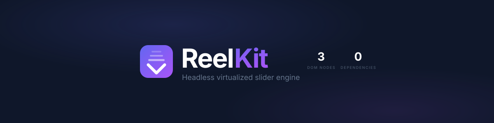
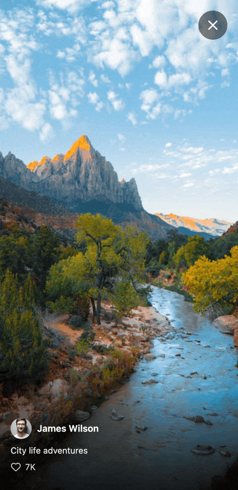
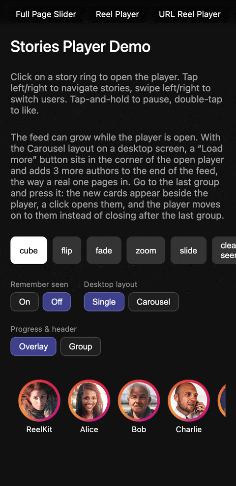
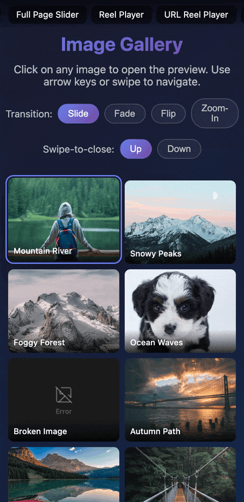

<picture>
  <source media="(prefers-color-scheme: dark)" srcset="assets/banner-dark.svg">
  <source media="(prefers-color-scheme: light)" srcset="assets/banner-light.svg">
  
</picture>

<p align="center">
  Single-item slider for TikTok/Instagram Reels-style experiences.<br/>
  Virtualized · Touch-first · Zero dependencies · Framework-agnostic
</p>

<table align="center">
  <tr>
    <th>Reels</th>
    <th>Stories</th>
    <th>Lightbox</th>
  </tr>
  <tr>
    <td align="center"><a href="https://react-demo.reelkit.dev/reel-player?utm_source=github"></a></td>
    <td align="center"><a href="https://react-demo.reelkit.dev/stories-player?utm_source=github"></a></td>
    <td align="center"><a href="https://react-demo.reelkit.dev/image-preview?utm_source=github"></a></td>
  </tr>
</table>

<p align="center">
  <a href="https://www.npmjs.com/package/@reelkit/core"></a>
  
  
  
  
  <br/>
  <a href="https://github.com/KonstantinKai/reelkit"></a>
</p>

> [!WARNING]
> **0.x.x** — ReelKit is under active development. APIs may change between minor versions until 1.0.

## Features

- **Virtualized** — only 3 slides in DOM, handles 10,000+ items
- **Touch first** — native swipe with momentum and snap
- **Zero dependencies** — ~10.1 kB gzip core
- **Keyboard & wheel** — arrow keys, scroll, and swipe navigation built in
- **Both axes** — vertical or horizontal, plus two-axis nesting for stories
- **Loop mode** — infinite circular scrolling
- **Ready-made overlays** — reel player, lightbox, and stories player, themed through CSS custom properties
- **Media built in** — neighbour preloading, shared video element, sound, timeline, fullscreen
- **Shareable URL state** — deep-link a slide by index or stable id, restored on load
- **Viewed state** — remember what the reader has seen in local, session, or memory storage
- **Overlay focus handling** — focus trap while open, focus returned to the opener on close
- **SSR ready** — works with Next.js, Nuxt, Remix, and any SSR setup
- **Auto-size** — omit size prop, uses CSS + ResizeObserver
- **TypeScript** — strict types, no `@types` needed

## Packages

| Package                                                                    | Description                       | JS (gzip) | CSS (gzip) |
| -------------------------------------------------------------------------- | --------------------------------- | --------- | ---------- |
| [@reelkit/core](packages/reelkit-core)                                     | Framework-agnostic slider engine  | 10.1 kB   | —          |
| [@reelkit/react](packages/reelkit-react)                                   | React components and hooks        | 4.9 kB    | —          |
| [@reelkit/react-reel-player](packages/reelkit-react-reel-player)           | Full-screen video reel player     | 5.4 kB    | 2.1 kB     |
| [@reelkit/react-lightbox](packages/reelkit-react-lightbox)                 | Image & video gallery lightbox    | 3.4 kB    | 1.6 kB     |
| [@reelkit/stories-core](packages/reelkit-stories-core)                     | Framework-agnostic stories engine | 3.3 kB    | —          |
| [@reelkit/react-stories-player](packages/reelkit-react-stories-player)     | Instagram-style stories player    | 7.5 kB    | 2.0 kB     |
| [@reelkit/angular](packages/reelkit-angular)                               | Angular standalone components     | 16.0 kB   | —          |
| [@reelkit/angular-reel-player](packages/reelkit-angular-reel-player)       | Full-screen video reel player     | 24.4 kB   | 3.5 kB     |
| [@reelkit/angular-lightbox](packages/reelkit-angular-lightbox)             | Image & video gallery lightbox    | 16.4 kB   | 2.2 kB     |
| [@reelkit/angular-stories-player](packages/reelkit-angular-stories-player) | Instagram-style stories player    | 34.0 kB   | 3.0 kB     |
| [@reelkit/vue](packages/reelkit-vue)                                       | Vue 3 components and composables  | 5.1 kB    | —          |
| [@reelkit/vue-reel-player](packages/reelkit-vue-reel-player)               | Full-screen video reel player     | 6.2 kB    | 2.1 kB     |
| [@reelkit/vue-lightbox](packages/reelkit-vue-lightbox)                     | Image & video gallery lightbox    | 4.2 kB    | 1.4 kB     |
| [@reelkit/vue-stories-player](packages/reelkit-vue-stories-player)         | Instagram-style stories player    | 7.9 kB    | 2.0 kB     |

Every overlay ships its stylesheet separately from the JavaScript — import the
package CSS once, then theme it with `--rk-*` custom properties. Budget both
columns: a React lightbox is 3.4 kB of JavaScript plus 1.6 kB of CSS on top of
the 10.1 kB core.

## Try It

| Framework | Live Demo                                                                                                                                          | Playground                                                                                                                                                                           |
| --------- | -------------------------------------------------------------------------------------------------------------------------------------------------- | ------------------------------------------------------------------------------------------------------------------------------------------------------------------------------------ |
| React     | [](https://react-demo.reelkit.dev/?utm_source=github)       | [](https://stackblitz.com/github/KonstantinKai/reelkit-react-starter)     |
| Angular   | [](https://angular-demo.reelkit.dev/?utm_source=github) | [](https://stackblitz.com/github/KonstantinKai/reelkit-angular-starter) |
| Vue       | [](https://vue-demo.reelkit.dev/?utm_source=github)        | [](https://stackblitz.com/github/KonstantinKai/reelkit-vue-starter)         |

Two more examples run locally rather than as hosted demos, and show the
server-rendering setup end to end:

| Package manager     | [Next.js App Router](apps/example-next) | [Nuxt 3](apps/example-nuxt)     |
| ------------------- | --------------------------------------- | ------------------------------- |
| pnpm (repo default) | `pnpm exec nx dev example-next`         | `pnpm exec nx dev example-nuxt` |
| npm                 | `npx nx dev example-next`               | `npx nx dev example-nuxt`       |
| yarn                | `yarn nx dev example-next`              | `yarn nx dev example-nuxt`      |

The repo is pinned to pnpm 11 through `packageManager` in `package.json`, so that
row is the path contributors take; the others work the same once dependencies are
installed. See the [SSR guide](https://reelkit.dev/docs/ssr) for what the two
examples demonstrate.

## Quick Start

```bash
npm install @reelkit/react
```

```tsx
import { useState } from 'react';
import { Reel, ReelIndicator } from '@reelkit/react';

function App() {
  return (
    <Reel
      className="my-reel"
      count={100}
      direction="vertical"
      itemBuilder={(i) => (
        <div style={{ width: '100%', height: '100%' }}>Slide {i + 1}</div>
      )}
    >
      <ReelIndicator />
    </Reel>
  );
}
```

By default, `Reel` measures its own size from CSS via `ResizeObserver` — no explicit `width`/`height` props needed. Just set the container size with CSS:

```css
.my-reel {
  width: 100%;
  height: 100dvh;
}
```

## Documentation

Full documentation, interactive demos, and API reference at **[reelkit.dev](https://reelkit.dev)**, in English, Ukrainian, Chinese, Portuguese, Japanese, Hindi, and Spanish.

Release notes for every package: [CHANGELOG.md](CHANGELOG.md), also published at [reelkit.dev/docs/changelog](https://reelkit.dev/docs/changelog).

## AI / LLM Integration

Machine-readable docs for AI coding assistants.

| Endpoint                                                                         | Purpose                                                  |
| -------------------------------------------------------------------------------- | -------------------------------------------------------- |
| [`reelkit.dev/llms.txt`](https://reelkit.dev/llms.txt)                           | Link index of every doc page. Drop into any LLM context. |
| [`reelkit.dev/llms-full.txt`](https://reelkit.dev/llms-full.txt)                 | Same index with embedded per-page summaries.             |
| [`context7.com/websites/reelkit_dev`](https://context7.com/websites/reelkit_dev) | Context7 manifest. Use with the `@context7` MCP server.  |

Both `.txt` endpoints regenerate on every docs build, so the corpus tracks the published site.

### In-browser agents (WebMCP)

Every page on [reelkit.dev](https://reelkit.dev) registers [WebMCP](https://webmachinelearning.github.io/webmcp/) tools, so an agent running in the reader's browser queries the docs instead of scraping the rendered page.

| Tool          | Purpose                                                                              |
| ------------- | ------------------------------------------------------------------------------------ |
| `list_pages`  | Every docs page with its title, URL, and group.                                      |
| `search_docs` | Site search by `query`, optional `locale` and `framework`, section anchors included. |
| `get_page`    | One page as markdown — the English text `llms-full.txt` holds for it.                |
| `open_page`   | Opens a page in the current tab, in the reader's language, optionally at a section.  |

WebMCP is a draft standard. On reelkit.dev it runs in Chrome 149–156 through an origin trial; elsewhere Chrome needs `chrome://flags/#enable-webmcp-testing`. Browsers without it load nothing extra, and the tools only read the public docs — no cookies, no storage, no off-site requests. Details on [reelkit.dev/docs/llms](https://reelkit.dev/docs/llms).

## Development

```bash
pnpm install          # install dependencies
pnpm build            # build all packages
pnpm test             # run all tests
pnpm e2e              # run all Playwright suites
pnpm check            # format + lint + typecheck + docs check
pnpm fmt              # fix formatting
```

See [CONTRIBUTING.md](CONTRIBUTING.md) for the full guide.

## Support

If ReelKit saved you some time, a star on GitHub would mean a lot — it's a small thing, but it really helps the project get noticed.

<p>
  <a href="https://github.com/KonstantinKai/reelkit"></a>
  &nbsp;
  <a href="https://buymeacoffee.com/konstantinkai"></a>
</p>

## License

[MIT](LICENSE)
